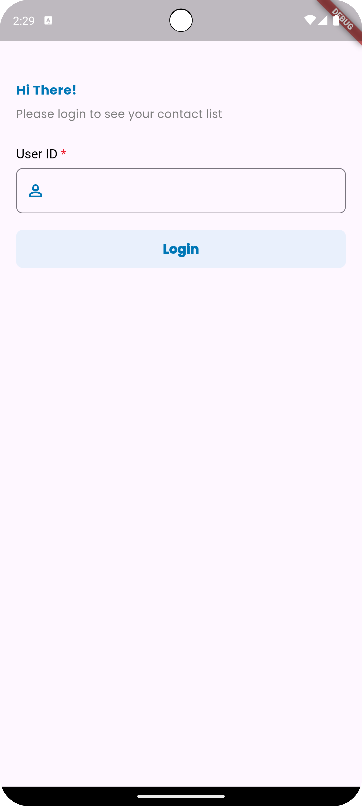
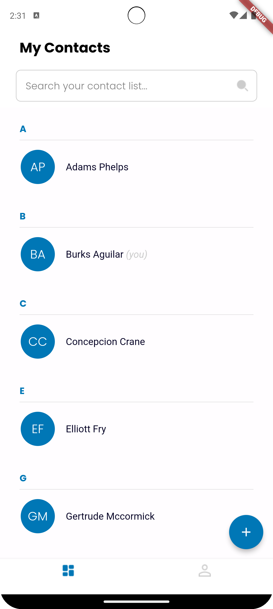
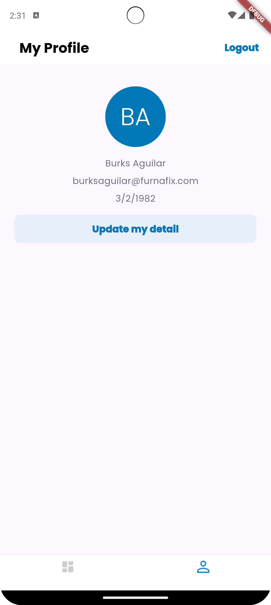
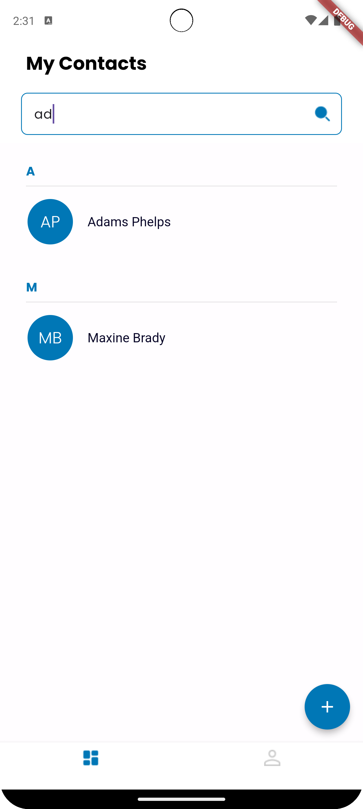
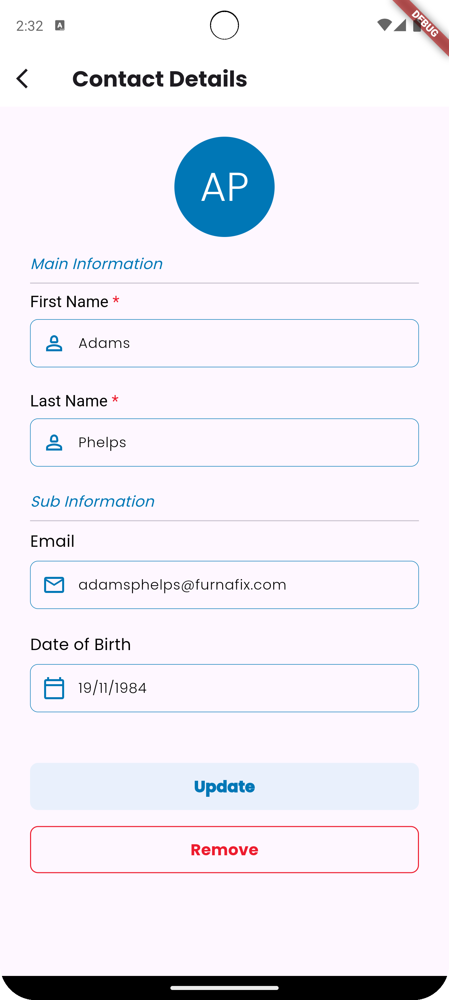
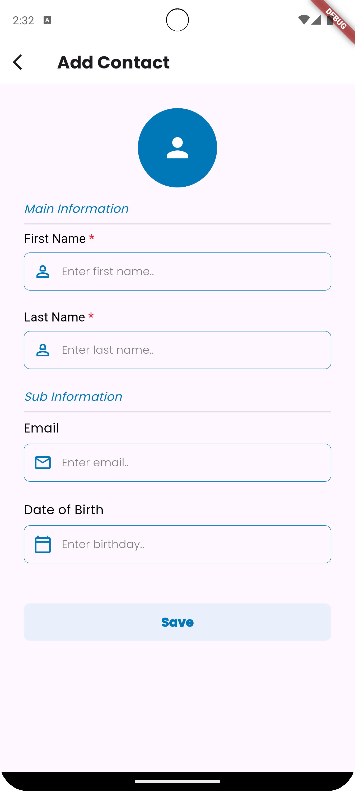

# contact_app

## Description
A Simple contact app using Flutter

---

## Development Environment

- **Operating System**: macOS Sequoia 15.0.1
- **Flutter Version**: 3.22.2 • channel stable
- **Dart Version**: 3.4.3
- **IDE**: Android Studio Koala
- **Device for Testing**: Pixel 8 Pro API 34 Emulator

## Screenshot
- Login Page

- Home Page

- Profile Page

- Search Result

- Edit Contact Page

- Add Contact Page

